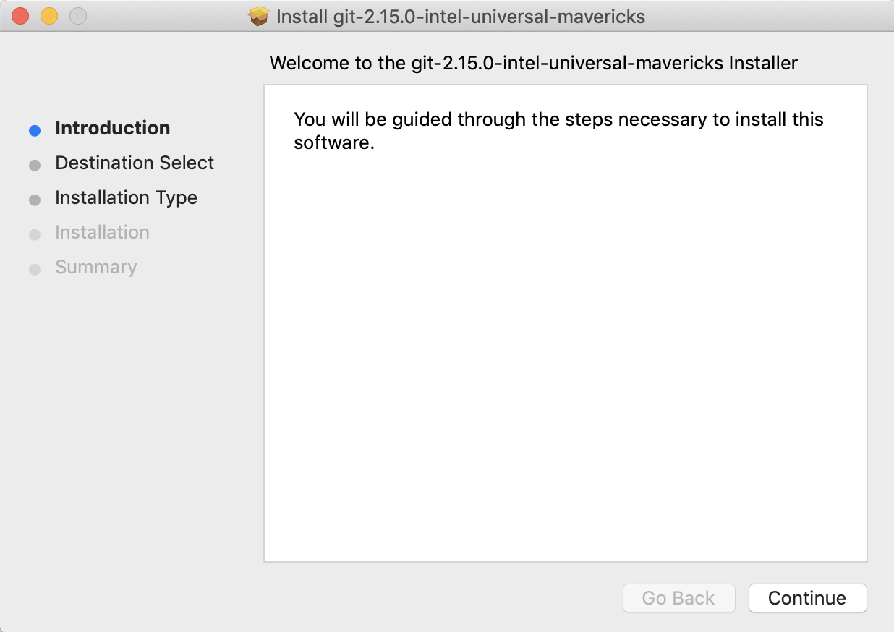
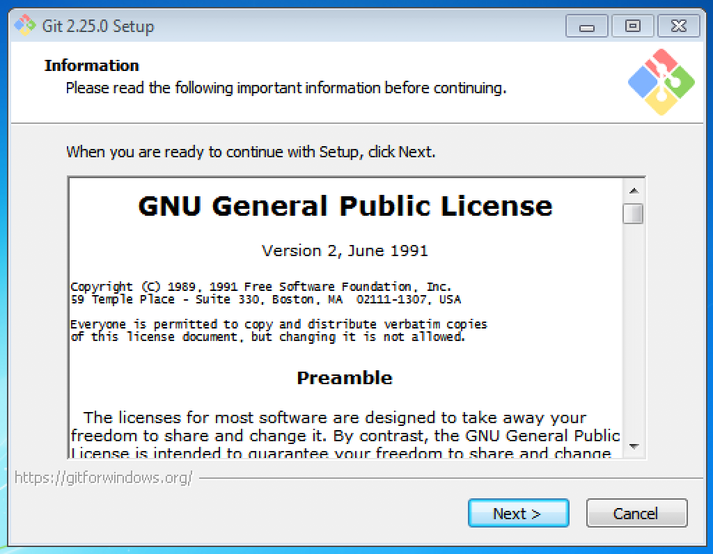
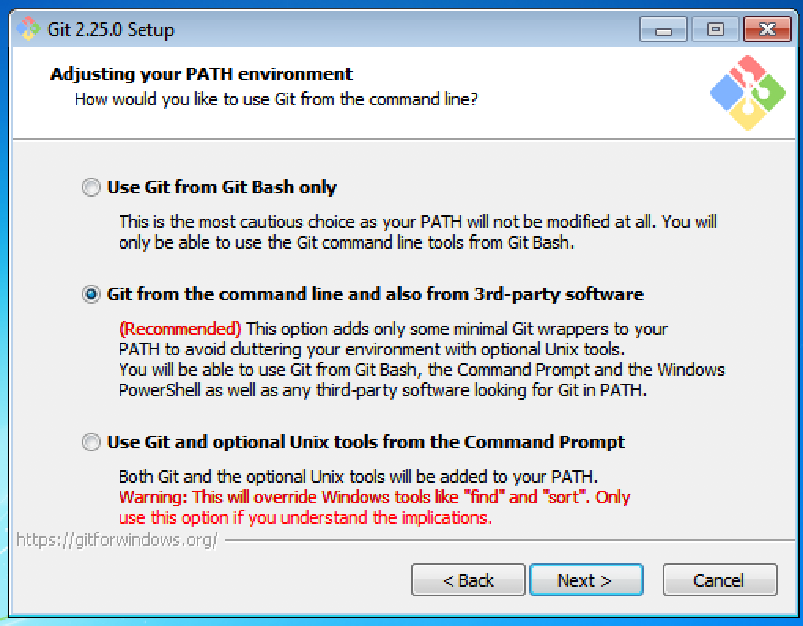

# Git Installation


First, create an account on [GitHub][github] (recommended) or [GitLab][gitlab]. Both are hosting sites for online Git repositories. You can think of a repository as a bucket containing snapshots of the state of your project and all of the code within it at a given point in time. This means that if you ever change something you should have not changed, make ammendments to bugs and other issues, or would simply like to go back to the previous version of a file, you will always have all of your versions at your disposal.

Follow the instructions below for your respective OS to set up git on your machine.

**Note:** We will go over a “Brief Introduction To Git” during our first session. 

## **[Mac][mac-git-ref]**

By deafault, you will have Git available on your Mac, but if you would like to have the absolute latest version, please folow the steps outlined in this section.

1. Download the latest Git for Mac installer from [sourceforge](https://sourceforge.net/projects/git-osx-installer/files/).

2. Once the download finishes, open the **.dmg** package and follow the prompts to install Git.



3. Open a terminal and verify the installation was successful by typing **git --version**:

```sh
$ git --version
git version 2.15.0
```

## **[Windows][windows-git-ref]**

1. Download the latest Git for Windows installer.

2. Run the installer and you should see the Git Setup wizard screen. You can leave most of the default options as they are, except where noted below. 



 **Note:** Git Bash is an application for Microsoft Windows environments which provides an emulation layer for a Git command line experience. It is a useful option for users to interface with git through written commands. Click [here][git-bash] for information on using Git Bash. 

Please choose the following option during installation:



Follow the Next and Finish prompts to complete the installation. 

3. Open a Command Prompt or Git Bash from the Start menu to start using Git.

##### **[Linux][linux-git-ref]**:

On Linux, you can install git using the following commands for your respective OS.

- **Debian / Ubuntu (apt-get)**

Git packages are available via apt:

1. From your shell, install Git using apt-get (enter your password if prompted): 

```sh
$ sudo apt-get update 
$ sudo apt-get install git
```

2. Verify the installation was successful by typing **git --version**: 

```sh
$ git --version
git version 2.20.1
```

- **Fedora (dnf/yum)**

Git packages are available via both yum and dnf: 

1. From your shell, install Git using dnf (or yum, on older versions of Fedora):

```sh
$ sudo dnf install git
```

Or

```sh
$ sudo yum install git
```

Note: You may be asked to confirm the download and installation - enter y to confirm. 

2. Verify the installation was successful by typing git --version:

```sh
$ git --version
 git version 2.20.1
```

If your OS is not listed above, please check the installation instructions here [linux-other-os].


#### Useful Guides & Resources:
- [The Official Git Homepage][git-homepage]
- [Interactive Git Tutorial][git-tutorial]
- [GitHub Introduction][git-intro] & [GitHub Help Page][github-help]
- [Atlassian Git Tutorials and Training][atlassian-tutorial]
- [Basic Git Commands][commands-ref]


[github]: <https://github.com>
[gitlab]: <https://gitlab.com/>
[mac-git-ref]: <https://sourceforge.net/projects/git-osx-installer/files/>
[windows-git-ref]: <https://www.linode.com/docs/development/version-control/how-to-install-git-on-linux-mac-and-windows/>
[git-bash]: <https://www.atlassian.com/git/tutorials/git-bash>
[linux-git-ref]: <https://www.atlassian.com/git/tutorials/install-git#linux>
[linux-other-os]: <https://www.linode.com/docs/development/version-control/how-to-install-git-on-linux-mac-and-windows/>
[git-push]: <https://www.atlassian.com/git/tutorials/syncing/git-push>
[git-homepage]: <https://git-scm.com/>
[git-tutorial]: <https://try.github.io/>
[git-intro]: <https://guides.github.com/activities/hello-world/>
[github-help]: <https://help.github.com/en>
[atlassian-tutorial]: <https://www.atlassian.com/git/tutorials>
[commands-ref]: <https://confluence.atlassian.com/bitbucketserver/basic-git-commands-776639767.html>
